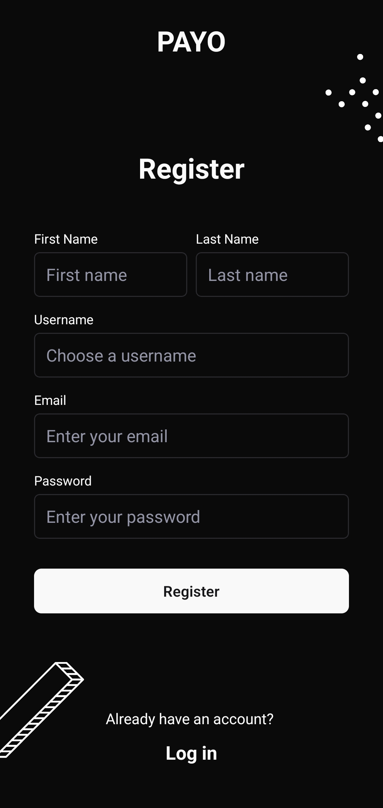
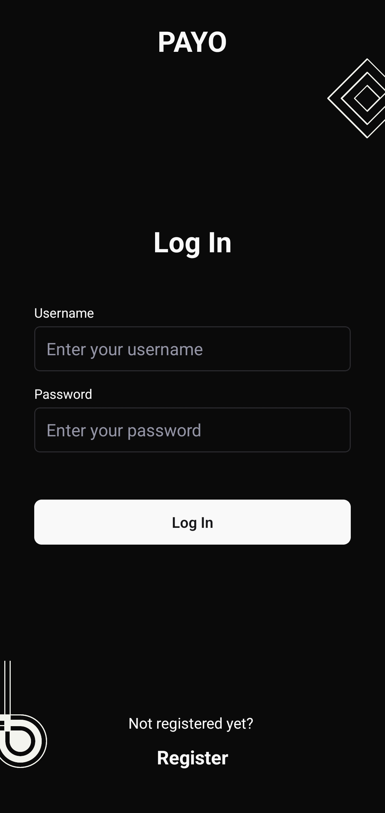
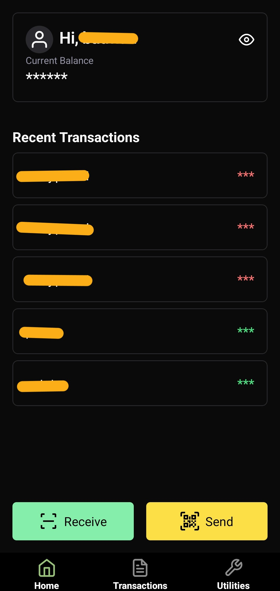
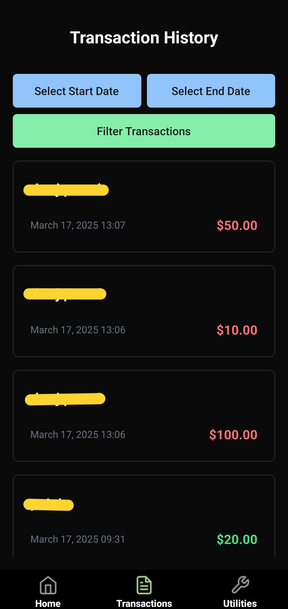

# Payo Frontend

This is the Frontend for the application **PAYO**, built using React Native with Expo as the framework.

## Features

- **OneTimeQR Code Generation**  
  Customers generate a secure, one-time-use QR code locally (offline) containing essential payment metadata.  
  Ensures privacy and offline usability until payment is initiated.

- **Server-Side Payment Verification**  
  Merchants scan the QR code and interact with the backend server to authenticate and complete the payment.  
  Secure transaction processing with validation of both customer and merchant credentials.

- **Secure & Lightweight Architecture**  
  Minimalistic and fast design optimized for low latency during merchant-side transactions.  
  Suitable for devices with limited connectivity or computational resources.

- **User Identity & Wallet Management**  
  Each user has a digital wallet and a unique identifier.  
  QR codes contain encrypted references to the wallet for verification.

- **Transaction Logging & History**  
  Every transaction is recorded with timestamp, amount, and involved parties.  
  Useful for auditing and tracking payment activity.

- **Error Handling & Fail-Safe Checks**  
  Robust backend logic to handle invalid QR codes, expired sessions, and double spending attempts.


## Installation

1. Clone the repository:
  ```bash
  git clone https://github.com/your-username/payo-frontend.git
  ```
2. Navigate to the project directory:
  ```bash
  cd payo-frontend
  ```
3. Install dependencies:
  ```bash
  npm install
  ```

## Usage

1. Start the development server:
  ```bash
  expo start
  ```
2. Use the Expo Go app to scan the QR code and run the app on your device.

## Scripts

- `expo start`: Start the development server.
- `expo build`: Build the app for production.
- `npm test`: Run tests.

## Screenshots




